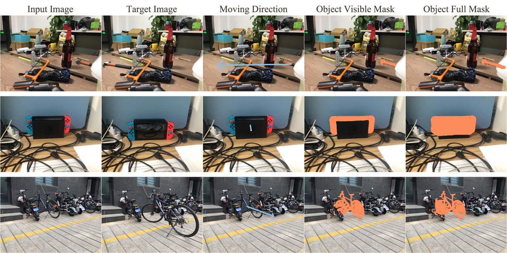

# ReS dataset of "Repositioning The Subject Within Image"

\[[preprint](https://arxiv.org/abs/2401.16861)\]\[[intro](https://yikai-wang.github.io/seele/)\]\[demo:[Youtube](https://www.youtube.com/watch?v=dJb-lWaPT6E),[Bilibili](https://b23.tv/iVIyvgj)\]



## Overview
This repo contains the proposed dataset ReS in our paper "[Repositioning The Subject Within Image](https://arxiv.org/abs/2401.16861)" .

> Subject repositioning aims to relocate a user-specified subject within a single image. Our proposed SEELE effectively addresses the generative sub-tasks within a unified prompt-guided inpainting task, all powered by a single diffusion generative model.

> We curated a benchmark dataset called ReS. This dataset includes 100 paired images, featuring a repositioned subject while the other elements remain constant. These images were collected from over 20 indoor and outdoor scenes, showcasing subjects from more than 50 categories. This variety enables effective simulation of real-world open-vocabulary applications.

## Download

The Res Dataset is available at [Google Drive](https://drive.google.com/file/d/1mqZDL0SjAyLA0r7zeLgyEo3pvLXVE8Va/view?usp=sharing), [Baidu Netdisk](https://pan.baidu.com/s/16P4aNvCS4LmyoVFpfH2Vlw?pwd=eva0).


## Structure 

Unzip the file, and you will get a folder including:

```
pi_1.jpg # The first view of the scene i
pi_2.jpg # The second view of the scene i
pi_1_mask.png # The visiable mask of subject in the first view
pi_1_amodal.png # The full mask of subject in the first view
pi_2_mask.png # The visiable mask of subject in the second view
pi_2_amodal.png # The full mask of subject in the second view
```

The images were taken using two different mobile devices. Some are sized 1702x1276, while others are 4032x3024. Each pair has the same resolution.

The masks corresponding to these images are annotated based on SAM, with a maximum length of 1024.

## Loading

We provide an example script [Res.py](./ReS.py) for loading the ReS dataset.

In the script, we define a class **ReS** that is initialized with:
```
res = ReS(root_dir, img_size, load_square)
```
The first parameter is the folder path, the ```img_size``` is the minimum side length you want. If you set ```load_square``` to true, the images will be resized as square images.

Paired images represent two tasks in this context, with each task starting from one side. If an image is occluded, we only use it as the source image.

The ```__getitem__``` function processes a specific task and outputs a dict with
```
'image': the source image
'mask': the remove mask of the subject in the source location
'gt': the target image
'amodal': the complete mask of the subject in the target location
'size': resolution of the image
'masked_image': masked image
``` 
We assume the results are inputed to the SD. Please adjust the function as needed for your convenience.

## Intended Uses

The data are intended for research purposes to advance the progess of subject repositioning.

## Limiatations

Due to the perspective shift, the size and the view of the subject after repositioning will change. We don't provide annotations for this, so using the target image directly for quantitative analysis may not be accurate.

## Citation

If you found the provided dataset useful, please cite our work.

```
@article{wang2024repositioning,
  title={Repositioning the Subject within Image},
  author={Wang, Yikai and Cao, Chenjie and Dong, Qiaole and Li, Yifan and Fu, Yanwei},
  journal={arXiv preprint arXiv:2401.16861},
  year={2024}
}
```